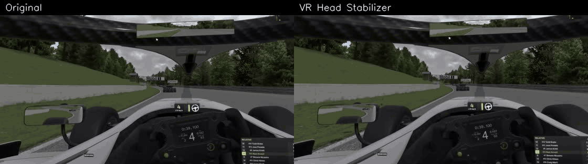

# VR Head Stabilizer for OBS

An OBS Studio filter that removes the small, fast head vibrations from a VR game capture while keeping the image intact. Deliberate head movement passes through naturally; only the tremor is cancelled. Built for iRacing streams, works with any VR mirror window.



Left: the raw iRacing capture. Right: what OBS records with the filter enabled. Both sides use the same 5% zoom.

## How it works

Each frame, the filter measures how the whole image moved since the previous frame (shift and roll), learning over time which pixels belong to the cockpit and which to the scenery so that it tracks the head and not the car. Smooth motion is kept, the non-smooth part is cancelled, and a small crop zoom hides the edges. The image is only shifted and rotated, never warped.

Cost is about 2 ms of CPU per frame plus one small GPU pass, and overlays or webcam sources are not affected because the filter sits on the game capture only.

## Installation

1. Download the latest release, or build it (see below).
2. Copy the `obs-vr-stabilizer` folder into `%ProgramData%\obs-studio\plugins\`.
3. In OBS, right click the game capture source, open Filters, and add "VR Head Stabilizer".

Requires OBS Studio 31 or newer, Windows x64.

## Settings

| Setting | Default | Effect |
|---|---|---|
| Crop zoom | 5 % | Room available for corrections. 4 to 6 % works well at 1080p. |
| Strength | 100 % | How much of the correction is applied. |
| Smoothing | 0.3 s | Higher removes slower vibration, but delays the start of head turns slightly. |
| Max roll correction | 0.4 deg | Limit for tilt correction, 0 disables it. |

Advanced settings (fast-motion follow, recenter time, analysis resolution, bypass, statistics logging) are available in the filter properties. If turns feel floaty, lower Smoothing. If vibration remains, raise Smoothing or Crop zoom.

## Building

Visual Studio 2022 or 2026 with the C++ workload and CMake 3.28 or newer.

```bash
cmake --preset windows-x64
cmake --build build_x64 --config RelWithDebInfo
cmake --install build_x64 --config RelWithDebInfo
```

The first configure downloads the OBS sources and dependencies into `.deps/` and builds libobs. The `tools/` folder contains the Python scripts used to tune and verify the filter against real and synthetic footage, and `vrstab-test` validates the motion estimator offline.

## License

GPL-2.0-or-later, like OBS Studio.
